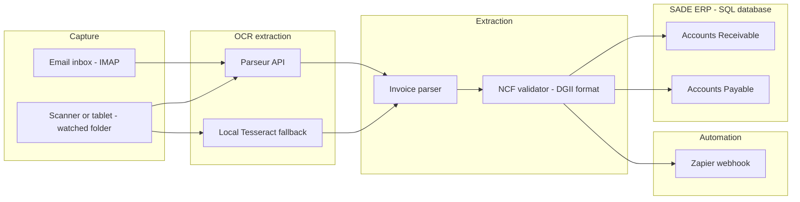

# Invoice OCR + ERP Automation Agent


[](https://codecov.io/gh/MrBoyard7/invoice-ocr-erp-automation-agent)
[](https://opensource.org/licenses/MIT)

[](https://github.com/psf/black)
[](https://github.com/astral-sh/ruff)
[](https://mypy-lang.org/)


A production-style reference implementation of an **automated invoice
capture pipeline** for accounting firms: documents come in by email or
scanner, get OCR'd, are normalized and validated (including Dominican
Republic NCF fiscal receipt numbers), and are posted straight into a
SQL-backed ERP — no manual data entry required.

> **Portfolio project.** This repository was built as a public demonstration
> of skills (OCR automation, workflow orchestration, ERP/SQL integration,
> clean Python architecture). "SADE" is used throughout as an example name
> for a SQL-backed accounting ERP; the connector targets any
> SQLAlchemy-compatible database and is not tied to a specific vendor.

## Table of contents

- [Problem statement](#problem-statement)
- [Features](#features)
- [Architecture](#architecture)
- [Tech stack](#tech-stack)
- [Project structure](#project-structure)
- [Getting started](#getting-started)
- [Configuration](#configuration)
- [Usage](#usage)
- [Testing](#testing)
- [Continuous integration](#continuous-integration)
- [Roadmap](#roadmap)
- [License](#license)

## Problem statement

Accounting firms often receive Accounts Receivable (AR) and Accounts
Payable (AP) invoices as scanned paper, tablet captures, or email
attachments, and staff re-key each one into the ERP by hand. This project
automates that entire path:

1. **Capture** invoices from email and scanner/tablet sources.
2. **Extract** tax data and amounts with OCR (Parseur, with a local
   Tesseract fallback).
3. **Orchestrate** the flow with event-driven automation (Zapier-compatible
   webhooks).
4. **Post** validated, duplicate-free transactions directly into the ERP's
   SQL database as AR/AP entries.

## Features

- 📥 **Two ingestion adapters** — IMAP email and a scanner/tablet watched
  folder — behind a single `DocumentSource` interface.
- 🔍 **Pluggable OCR layer** — a `Parseur` API client for high-accuracy
  structured extraction, and a free local `Tesseract` client for
  development or low-volume use.
- 🧾 **Domain-aware extraction** — normalizes dates, amounts, and currencies,
  and validates Dominican Republic **NCF / e-CF** fiscal receipt numbers.
- ⚡ **Workflow automation** — publishes `invoice_processed` /
  `invoice_failed` events to a Zapier webhook so the firm can fan them out
  to email, spreadsheets, or Slack with zero code changes.
- 🏦 **SQL ERP integration** — a repository layer that posts Accounts
  Receivable and Accounts Payable rows via SQLAlchemy, portable across
  SQLite, PostgreSQL, MySQL, or SQL Server.
- 🧪 **Fully tested** — unit and integration tests with mocked external
  services, run automatically in CI with coverage reporting.
- 🧱 **Clean, swappable architecture** — every stage (ingestion, OCR,
  extraction, automation, ERP) is injected as a dependency, so any piece can
  be swapped without touching the others.

## Architecture



See [`docs/architecture.md`](docs/architecture.md) for a detailed
description of each stage and the design decisions behind them.

## Tech stack

| Concern              | Choice                                   |
|-----------------------|------------------------------------------|
| Language              | Python 3.9+                              |
| Data validation       | Pydantic v2                              |
| Database / ORM        | SQLAlchemy 2.0                           |
| HTTP client           | requests                                 |
| CLI                    | click                                    |
| OCR                    | Parseur API, Tesseract (local fallback)  |
| Automation             | Zapier (webhooks)                        |
| Testing                | pytest, pytest-cov                       |
| Formatting / linting   | black, ruff                              |
| Static typing          | mypy                                     |
| CI/CD                  | GitHub Actions, Codecov                  |

## Project structure

```text
invoice-ocr-erp-automation-agent/
├── .github/
│   └── workflows/
│       └── ci.yml                     # Lint, type-check, test, coverage upload
├── docs/
│   └── architecture.md                # Detailed architecture & design notes
├── examples/
│   └── sample_parseur_output.json     # Example structured OCR payload
├── scripts/
│   └── run_demo.py                    # Self-contained, credential-free demo
├── src/
│   └── invoice_automation/
│       ├── __init__.py
│       ├── cli.py                     # `invoice-automation` command-line entry point
│       ├── config.py                  # Environment-driven settings
│       ├── exceptions.py              # Package-wide exception hierarchy
│       ├── pipeline.py                # End-to-end orchestrator
│       ├── ingestion/
│       │   ├── base.py                # DocumentSource / RawDocument contract
│       │   ├── email_ingestor.py      # IMAP email ingestion
│       │   └── scanner_ingestor.py    # Scanner / tablet watched-folder ingestion
│       ├── ocr/
│       │   ├── base.py                # OCRClient / OCRResult contract
│       │   ├── parseur_client.py      # Parseur API integration
│       │   └── tesseract_client.py    # Local OCR fallback
│       ├── extraction/
│       │   ├── schemas.py             # InvoiceData / LineItem Pydantic models
│       │   ├── ncf_validator.py       # Dominican Republic NCF / e-CF validation
│       │   └── invoice_parser.py      # OCR output -> InvoiceData normalization
│       ├── automation/
│       │   ├── zapier_client.py       # Zapier webhook client
│       │   └── workflow_orchestrator.py  # Downstream event notifications
│       └── erp/
│           ├── models.py              # SQLAlchemy AR / AP ORM models
│           ├── sade_connector.py      # SQL engine / session management
│           └── repository.py          # InvoiceData -> AR/AP persistence
├── tests/
│   ├── conftest.py                    # Shared fixtures
│   ├── test_ncf_validator.py
│   ├── test_invoice_parser.py
│   ├── test_ocr.py
│   ├── test_ingestion.py
│   ├── test_zapier_client.py
│   ├── test_erp_repository.py
│   └── test_pipeline.py
├── .env.example                       # Documented environment variables
├── .gitignore
├── CHANGELOG.md
├── CONTRIBUTING.md
├── LICENSE
├── Makefile                           # install / format / lint / test shortcuts
├── pyproject.toml                     # Packaging, dependencies, tool config
├── requirements.txt
└── requirements-dev.txt
```

## Getting started

### Prerequisites

- Python 3.9 or later
- `pip`
- (Optional, for local OCR) [Tesseract OCR](https://github.com/tesseract-ocr/tesseract)
  installed on your system

### Installation

```bash
git clone https://github.com/MrBoyard7/invoice-ocr-erp-automation-agent.git
cd invoice-ocr-erp-automation-agent

python -m venv .venv
source .venv/bin/activate      # On Windows: .venv\Scripts\activate

pip install -e ".[dev]"
```

If you want to use the local Tesseract OCR fallback, also install its
optional extra:

```bash
pip install -e ".[ocr-local]"
```

## Configuration

All configuration is environment-driven. Copy the example file and fill in
your own values:

```bash
cp .env.example .env
```

| Variable                  | Description                                               |
|----------------------------|-------------------------------------------------------------|
| `IMAP_HOST` / `IMAP_PORT`  | IMAP server for email-based ingestion                      |
| `IMAP_USERNAME` / `IMAP_PASSWORD` | Mailbox credentials                                  |
| `IMAP_MAILBOX`             | Mailbox/folder to poll (default `INBOX`)                    |
| `SCANNER_WATCH_FOLDER`     | Folder where scanned invoices are dropped                  |
| `SCANNER_PROCESSED_FOLDER` | Folder scanned files are moved to after ingestion           |
| `PARSEUR_API_KEY`          | Parseur API token                                           |
| `PARSEUR_MAILBOX_ID`       | Target Parseur parsing mailbox                              |
| `ZAPIER_WEBHOOK_URL`       | "Webhooks by Zapier" catch URL                              |
| `SADE_DATABASE_URL`        | SQLAlchemy connection string for the ERP database           |
| `LOG_LEVEL`                | Logging verbosity (default `INFO`)                          |

None of these are required to run the tests or the bundled demo — sensible
defaults point at a local SQLite database and skip any service that isn't
configured.

## Usage

### Run the credential-free demo

The fastest way to see the full pipeline in action, with no external
services required:

```bash
python scripts/run_demo.py
```

This ingests one simulated scanned invoice, runs it through a pre-recorded
OCR payload, validates it, and posts it into a local `demo.db` SQLite
database acting as the ERP.

### Run the command-line interface

```bash
# Validate a Dominican Republic NCF / e-CF value
invoice-automation validate-ncf B0100000001

# Run one pipeline pass over the configured scanner watch folder
invoice-automation run --invoice-type accounts_payable
```

## Testing

```bash
# Run the full test suite
pytest

# Run with a coverage report
pytest --cov=invoice_automation --cov-report=term-missing

# Or, using the provided shortcuts (requires `make`, see note below)
make test
make test-cov
```

Format and lint checks (also run in CI):

```bash
make format        # apply black formatting
make format-check  # verify formatting without modifying files
make lint          # run ruff
make check         # format-check + lint + test-cov, in one command
```

> **Windows note:** `make` is not installed by default on Windows. Either
> run the underlying `black`, `ruff`, and `pytest` commands directly (as
> shown above), or install `make` via
> [Chocolatey](https://chocolatey.org/) (`choco install make`) or
> [Scoop](https://scoop.sh/) (`scoop install make`).

## Continuous integration

Every push and pull request to `main` triggers the workflow defined in
[`.github/workflows/ci.yml`](.github/workflows/ci.yml), which:

1. Runs on Python 3.9, 3.10, 3.11, and 3.12.
2. Checks formatting with `black`.
3. Lints with `ruff`.
4. Runs the full test suite with coverage.
5. Uploads coverage results to Codecov (on the 3.11 job).

## Roadmap

- [ ] Add a `pdf2image`-based preprocessing step so the local Tesseract
      client can OCR multi-page PDFs directly.
- [ ] Add a native connector example for a specific SQL ERP schema.
- [ ] Add idempotent retry/backoff handling for Parseur polling and Zapier
      delivery.
- [ ] Add a lightweight web dashboard for reviewing failed documents.

## License

Distributed under the MIT License. See [`LICENSE`](LICENSE) for details.

Copyright (c) 2026 Prince Boyard MBOUNGOU NGOMA
