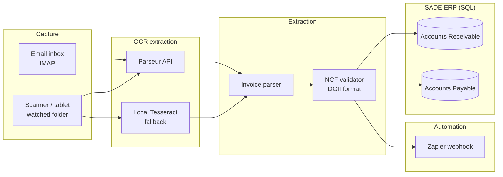

# Architecture

## Overview

This project automates the capture, extraction, and ERP posting of invoices
(Accounts Receivable and Accounts Payable) so an accounting firm no longer
needs to key invoice data in by hand. It is composed of five independent
stages connected by a thin pipeline orchestrator.

## Stages

1. **Ingestion** (`invoice_automation.ingestion`) - Adapters that retrieve raw
   documents from an email mailbox (IMAP) or a scanner/tablet watched folder.
   Both implement the same `DocumentSource` interface, so additional sources
   (e.g. a cloud storage bucket) can be added without touching the rest of
   the pipeline.

2. **OCR** (`invoice_automation.ocr`) - Converts raw document bytes into text
   and, where possible, structured fields. `ParseurClient` integrates with
   the Parseur API (upload + template-based parsing); `TesseractClient`
   offers a free, local fallback for development, testing, or low-volume
   deployments.

3. **Extraction** (`invoice_automation.extraction`) - Normalizes OCR output
   into a strongly-typed `InvoiceData` record (via Pydantic), including
   parsing of dates and monetary amounts and validation of the Dominican
   Republic fiscal receipt number (NCF / e-CF).

4. **Automation** (`invoice_automation.automation`) - Publishes pipeline
   events (`invoice_processed`, `invoice_failed`) to a Zapier webhook so the
   firm can fan them out to email alerts, spreadsheets, or other connected
   apps without any code changes.

5. **ERP** (`invoice_automation.erp`) - A SQLAlchemy-based connector and
   repository that post each `InvoiceData` record as an Accounts Receivable
   or Accounts Payable row. The connection string is fully configurable, so
   the same code can target SQLite (demos/tests), or PostgreSQL / MySQL /
   SQL Server in front of a real SADE ERP database.

## Design notes

- **The agent produces the data matrix, not the ERP UI.** As called out in
  the original project brief, this integration is not responsible for the
  ERP's own interface; its job is to deliver clean, validated,
  duplicate-free rows into the ERP's SQL tables.
- **Failures are isolated per document.** A single malformed invoice does
  not stop the batch; it is logged, reported via Zapier, and the pipeline
  continues with the next document (see `pipeline.PipelineResult`).
- **Everything is swappable.** OCR provider, automation platform, and ERP
  database are all injected as dependencies (`InvoiceAutomationPipeline`
  constructor), which keeps the core workflow logic testable in isolation
  from any third-party service.
